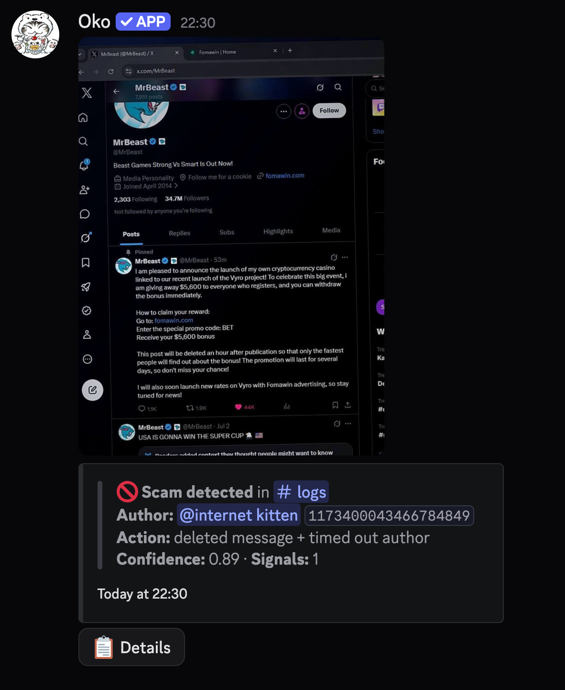
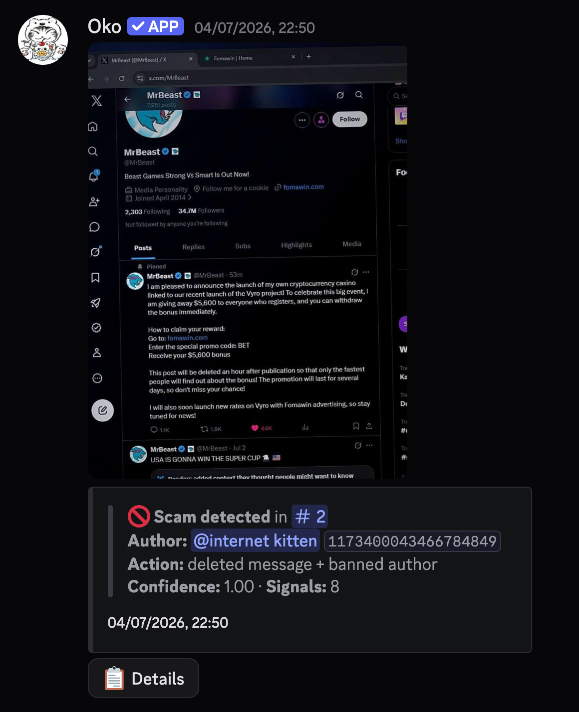

<div align="center">


# Oko

**Automatic crypto giveaway / phishing scam detection for Discord.**

Oko watches every message and image posted in your server, catches scam giveaways and phishing links before members can click them, and removes the message — automatically, no moderator required.

[github.com/totalling/oko-anti-crypto-scam-discord-bot](https://github.com/totalling/oko-anti-crypto-scam-discord-bot)

</div>

---

## What it catches

Scammers post the same handful of tricks over and over: a compromised or fake "verified" account announces a crypto giveaway, links a lookalike domain, and pressures people to act fast before the post is "deleted." Oko is built to catch exactly that pattern.

- **Text scans** — giveaway language, promo/bonus codes, urgency phrases ("only the fastest," "post will be deleted"), and known scam domains
- **Image scans (OCR)** — scam text baked into a screenshot is extracted and scanned the same way plain text is
- **Perceptual image hashing** — once one server flags an image as scam, every server running Oko recognizes near-identical reposts of it, even if it's cropped or recompressed
- **Impersonation detection** — flags messages that pair a watched public figure/brand name with giveaway bait
- **Honeypot channels** — an optional trap channel that punishes anyone (other than moderators) who types in it
- **Global blacklist** — opt-in, cross-server: when Oko bans someone in one server, every other server that's enabled it punishes that same user too — immediately if they're already a member, or the moment they join

## In action

<table>
<tr>
<td width="50%"></td>
<td width="50%"></td>
</tr>
<tr>
<td align="center"><sub>Low-signal message → timed out</sub></td>
<td align="center"><sub>High-confidence scam (8 signals) → banned</sub></td>
</tr>
</table>

Every detection is logged to your mod channel with the offending message's evidence, a confidence score, and a **Details** button moderators can use to review exactly what was flagged.

## Commands

### Setup & configuration (`Manage Server` required)

| Command | Description |
|---|---|
| `/scam toggle` | Turn auto-moderation on or off for this server |
| `/scam setlogchannel` | Set the channel scam detections get logged to |
| `/scam setpunishment` | Choose what happens to users caught by auto-moderation — **ban**, **kick**, or **timeout** |
| `/scam globalblacklist` | Punish members here who were banned by Oko in another server (opt-in) |
| `/scam stats` | Show current settings and blocklist sizes |

### Honeypot (`Manage Server` required)

| Command | Description |
|---|---|
| `/scam honeypot setup` | Create a trap channel — anyone who types in it (except mods) is punished |
| `/scam honeypot setpunishment` | Choose the punishment for honeypot triggers, independent of the main scam punishment |
| `/scam honeypot disable` | Remove the honeypot channel |

### General

| Command | Description |
|---|---|
| `/invite` | Get an invite link to add Oko to another server |
| `/support` | Get an invite to the support server |
| `/botinfo` | Bot stats — servers, members protected, scammers caught |
| **Mark as Known Scam** *(message context menu)* | Manually blacklist a message's author and learn its image hash |

### Bot owner only

| Command | Description |
|---|---|
| `/scam adddomain` / `removedomain` | Manage the global scam-domain blocklist |
| `/scam addname` | Add a name to the impersonation watchlist |

## Setup

**Requirements:** Python 3.10+, and [Tesseract OCR](https://github.com/tesseract-ocr/tesseract) installed on the host (`brew install tesseract` on macOS, `apt install tesseract-ocr` on Debian/Ubuntu).

```bash
git clone https://github.com/totalling/oko-anti-crypto-scam-discord-bot.git
cd oko-anti-crypto-scam-discord-bot
python3 -m venv venv
source venv/bin/activate
pip install -r requirements.txt
```

Create a `.env` file:

```env
DISCORD_TOKEN=your-bot-token
TESSERACT_CMD=/opt/homebrew/bin/tesseract   # path to the tesseract binary

# Scoring thresholds (0.0 - 1.0)
HEURISTIC_AUTO_SCAM_SCORE=0.6
CONFIDENCE_BAN_THRESHOLD=0.6
HASH_DISTANCE_THRESHOLD=8
```

Run it:

```bash
python3 main.py
```

### Running as a service

A sample `systemd` unit is included at [`deploy/oko.service`](deploy/oko.service) for running Oko persistently on a Linux host.

## Project structure

```
cogs/           Discord command groups & event listeners
detection/      Scam scoring — heuristics, OCR, perceptual image hashing
moderation/     Punishment actions, per-guild settings, mod-log UI
data/           Blocklists and persisted state (scam domains, watched names, guild settings)
```
